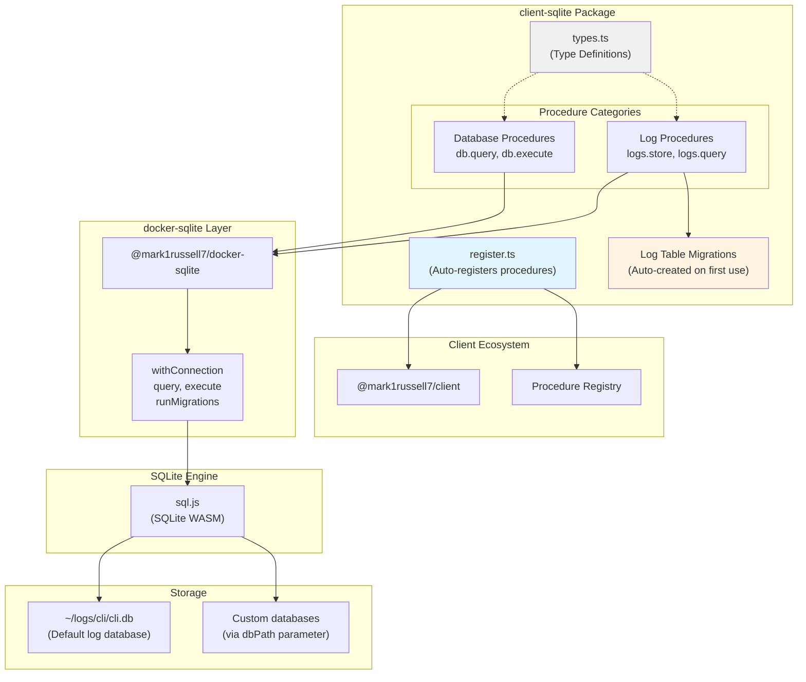
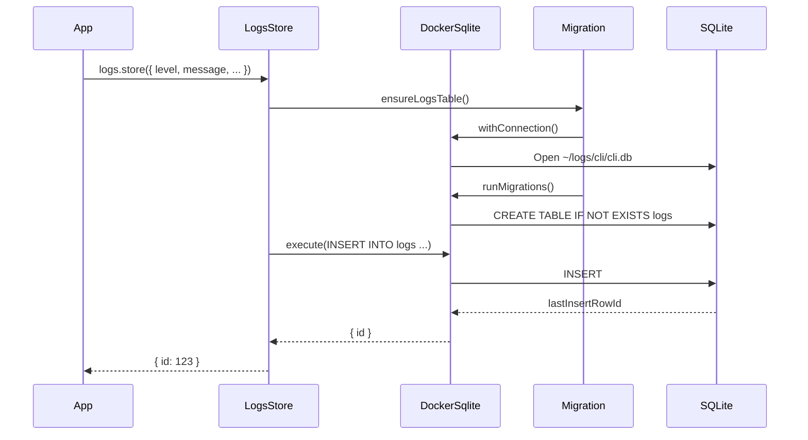

# @mark1russell7/client-sqlite

[](https://opensource.org/licenses/MIT)
[](https://www.typescriptlang.org/)
[](https://nodejs.org/)

SQLite database operations via client procedures. Execute queries and store structured logs via `client.call()`.

## Overview

`client-sqlite` provides SQLite database access through the client procedure ecosystem, with:
- **Database procedures**: Execute SQL queries and mutations
- **Logging procedures**: Store and query structured application logs
- **Migration support**: Schema versioning and migration utilities
- **Default log database**: Pre-configured logging at `~/logs/cli/cli.db`

The package auto-registers 4 procedures:
- **Database**: `db.query`, `db.execute`
- **Logs**: `logs.store`, `logs.query`

## Architecture



### Package Dependency Flow

```mermaid
graph LR
    App["Your Application"]
    ClientSqlite["@mark1russell7/client-sqlite"]
    Client["@mark1russell7/client"]
    DockerSqlite["@mark1russell7/docker-sqlite"]
    SqlJs["sql.js"]

    App --> ClientSqlite
    ClientSqlite --> Client
    ClientSqlite --> DockerSqlite
    DockerSqlite --> SqlJs

    App -.client.call.-> Client
    Client -.executes.-> ClientSqlite
    ClientSqlite -.queries.-> DockerSqlite
    DockerSqlite -.uses.-> SqlJs
```

### Log Storage Flow



## Installation

```bash
npm install @mark1russell7/client-sqlite
```

### Peer Dependencies

```json
{
  "@mark1russell7/client": "github:mark1russell7/client#main",
  "@mark1russell7/docker-sqlite": "github:mark1russell7/docker-sqlite#main"
}
```

## Configuration

### Default Database Path

The package uses a default database path for CLI logs:

```typescript
// Default: ~/logs/cli/cli.db
const DEFAULT_DB_PATH = join(homedir(), "logs", "cli", "cli.db");
```

You can override this path in each procedure call:

```typescript
await client.call(
  ["db", "query"],
  {
    sql: "SELECT * FROM logs",
    dbPath: "./custom/path/database.db"
  }
);
```

## API Reference

### Database Procedures

#### `db.query`

Execute a SQL SELECT query and return rows.

```typescript
const result = await client.call(
  ["db", "query"],
  {
    sql: "SELECT * FROM logs WHERE level = ? ORDER BY timestamp DESC",
    params: ["error"]
  }
);

console.log(result.rows);
console.log(result.columns);
```

**Input:**
```typescript
interface DbQueryInput {
  sql: string;              // SQL SELECT query
  params?: unknown[];       // Query parameters (uses ? placeholders)
  dbPath?: string;          // Database path (default: ~/logs/cli/cli.db)
}
```

**Output:**
```typescript
interface DbQueryOutput<T = Record<string, unknown>> {
  columns: string[];        // Column names
  rows: T[];                // Query results
}
```

**Example:**
```typescript
const result = await client.call(
  ["db", "query"],
  {
    sql: `
      SELECT level, COUNT(*) as count
      FROM logs
      WHERE session_id = ?
      GROUP BY level
    `,
    params: ["session-123"]
  }
);

// result.rows = [{ level: "info", count: 45 }, { level: "error", count: 2 }]
```

#### `db.execute`

Execute a SQL statement (INSERT, UPDATE, DELETE) and return the number of affected rows.

```typescript
const result = await client.call(
  ["db", "execute"],
  {
    sql: "DELETE FROM logs WHERE timestamp < ?",
    params: ["2024-01-01"]
  }
);

console.log(`Deleted ${result.changes} rows`);
```

**Input:**
```typescript
interface DbExecuteInput {
  sql: string;              // SQL statement (INSERT, UPDATE, DELETE, etc.)
  params?: unknown[];       // Statement parameters
  dbPath?: string;          // Database path (default: ~/logs/cli/cli.db)
}
```

**Output:**
```typescript
interface DbExecuteOutput {
  changes: number;          // Number of rows affected
}
```

**Examples:**
```typescript
// INSERT
await client.call(
  ["db", "execute"],
  {
    sql: "INSERT INTO users (name, email) VALUES (?, ?)",
    params: ["Alice", "alice@example.com"]
  }
);

// UPDATE
await client.call(
  ["db", "execute"],
  {
    sql: "UPDATE users SET active = ? WHERE id = ?",
    params: [true, 123]
  }
);

// DELETE
await client.call(
  ["db", "execute"],
  {
    sql: "DELETE FROM users WHERE active = ?",
    params: [false]
  }
);
```

### Log Procedures

#### `logs.store`

Store a structured log entry in the database. Automatically creates the logs table on first use.

```typescript
await client.call(
  ["logs", "store"],
  {
    level: "error",
    message: "Failed to connect to database",
    sessionId: "session-123",
    command: "db.connect",
    context: "user-service",
    data: {
      host: "localhost",
      port: 5432
    },
    errorStack: new Error().stack
  }
);
```

**Input:**
```typescript
interface LogsStoreInput {
  level: LogLevel;                    // Log level
  message: string;                    // Log message
  sessionId?: string;                 // Session ID for grouping logs
  command?: string;                   // Command that generated this log
  context?: string;                   // Additional context (e.g., package name)
  data?: Record<string, unknown>;     // Structured data (stored as JSON)
  errorStack?: string;                // Error stack trace
  dbPath?: string;                    // Database path (default: ~/logs/cli/cli.db)
}

type LogLevel = "trace" | "debug" | "info" | "warn" | "error";
```

**Output:**
```typescript
interface LogsStoreOutput {
  id: number;               // ID of the inserted log row
}
```

**Log Table Schema:**
```sql
CREATE TABLE logs (
  id INTEGER PRIMARY KEY AUTOINCREMENT,
  timestamp TEXT NOT NULL DEFAULT (datetime('now')),
  level TEXT NOT NULL CHECK (level IN ('trace', 'debug', 'info', 'warn', 'error')),
  message TEXT NOT NULL,
  data TEXT,                    -- JSON string
  session_id TEXT,
  command TEXT,
  context TEXT,
  error_stack TEXT,
  created_at TEXT NOT NULL DEFAULT (datetime('now'))
);

-- Indexes for fast queries
CREATE INDEX idx_logs_session ON logs(session_id);
CREATE INDEX idx_logs_level ON logs(level);
CREATE INDEX idx_logs_timestamp ON logs(timestamp);
CREATE INDEX idx_logs_command ON logs(command);
```

#### `logs.query`

Query log entries with filtering, pagination, and sorting.

```typescript
const result = await client.call(
  ["logs", "query"],
  {
    sessionId: "session-123",
    level: ["error", "warn"],
    limit: 100,
    orderBy: "desc"
  }
);

console.log(result.logs);
```

**Input:**
```typescript
interface LogsQueryInput {
  sessionId?: string;           // Filter by session ID
  command?: string;             // Filter by command
  level?: LogLevel | LogLevel[]; // Filter by log level(s)
  limit?: number;               // Maximum number of logs to return
  offset?: number;              // Offset for pagination
  orderBy?: "asc" | "desc";     // Order by timestamp (default: desc)
  dbPath?: string;              // Database path (default: ~/logs/cli/cli.db)
}
```

**Output:**
```typescript
interface LogsQueryOutput {
  logs: LogEntry[];
  total?: number;               // Total count (if limit was applied)
}

interface LogEntry {
  id: number;
  timestamp: string;            // ISO timestamp
  level: LogLevel;
  message: string;
  data: Record<string, unknown> | null;
  sessionId: string | null;
  command: string | null;
  context: string | null;
  errorStack: string | null;
}
```

**Examples:**
```typescript
// Get all errors from a session
const { logs } = await client.call(
  ["logs", "query"],
  {
    sessionId: "session-123",
    level: "error"
  }
);

// Get recent warnings and errors
const { logs } = await client.call(
  ["logs", "query"],
  {
    level: ["warn", "error"],
    limit: 50,
    orderBy: "desc"
  }
);

// Paginated query
const { logs } = await client.call(
  ["logs", "query"],
  {
    command: "lib.build",
    limit: 20,
    offset: 40  // Page 3 (0-indexed)
  }
);
```

## Usage Examples

### Basic Database Operations

```typescript
import { Client } from "@mark1russell7/client";

const client = new Client(/* config */);

// Create a table
await client.call(
  ["db", "execute"],
  {
    sql: `
      CREATE TABLE IF NOT EXISTS users (
        id INTEGER PRIMARY KEY AUTOINCREMENT,
        name TEXT NOT NULL,
        email TEXT UNIQUE NOT NULL,
        active BOOLEAN DEFAULT 1,
        created_at TEXT DEFAULT (datetime('now'))
      )
    `,
    dbPath: "./app.db"
  }
);

// Insert data
await client.call(
  ["db", "execute"],
  {
    sql: "INSERT INTO users (name, email) VALUES (?, ?)",
    params: ["Alice Johnson", "alice@example.com"],
    dbPath: "./app.db"
  }
);

// Query data
const result = await client.call(
  ["db", "query"],
  {
    sql: "SELECT * FROM users WHERE active = ? ORDER BY created_at DESC",
    params: [1],
    dbPath: "./app.db"
  }
);

console.log(result.rows);
```

### Structured Logging

```typescript
// Log an info message
await client.call(
  ["logs", "store"],
  {
    level: "info",
    message: "Starting build process",
    sessionId: "build-2024-03-15",
    command: "lib.build",
    context: "@myorg/package-name"
  }
);

// Log an error with stack trace
try {
  // Some operation
  throw new Error("Connection timeout");
} catch (error) {
  await client.call(
    ["logs", "store"],
    {
      level: "error",
      message: error.message,
      sessionId: "build-2024-03-15",
      command: "lib.build",
      context: "@myorg/package-name",
      data: {
        host: "api.example.com",
        timeout: 5000
      },
      errorStack: error.stack
    }
  );
}

// Query logs by session
const { logs } = await client.call(
  ["logs", "query"],
  {
    sessionId: "build-2024-03-15",
    orderBy: "asc"
  }
);

logs.forEach(log => {
  console.log(`[${log.level}] ${log.message}`);
  if (log.data) {
    console.log("  Data:", log.data);
  }
});
```

### Direct Database Access (Without RPC)

For lower-level access, use re-exported utilities from `docker-sqlite`:

```typescript
import {
  withConnection,
  query,
  execute,
  lastInsertRowId,
  runMigrations,
  createMigration
} from "@mark1russell7/client-sqlite";

// Managed connection with automatic cleanup
await withConnection({ dbPath: "./data/app.db" }, (db) => {
  // Execute mutations
  execute(db, "INSERT INTO users (name, email) VALUES (?, ?)", [
    "Bob Smith",
    "bob@example.com"
  ]);

  const userId = lastInsertRowId(db);
  console.log("Inserted user ID:", userId);

  // Query data
  const result = query<{ id: number; name: string; email: string }>(
    db,
    "SELECT * FROM users WHERE id = ?",
    [userId]
  );

  console.log(result.rows);
});

// Connection is automatically closed after callback
```

### Database Migrations

```typescript
import {
  withConnection,
  runMigrations,
  getMigrationStatus,
  rollbackMigration,
  type Migration
} from "@mark1russell7/client-sqlite";

const migrations: Migration[] = [
  {
    version: 1,
    description: "Create users table",
    up: `
      CREATE TABLE users (
        id INTEGER PRIMARY KEY AUTOINCREMENT,
        name TEXT NOT NULL,
        email TEXT UNIQUE NOT NULL,
        created_at TEXT DEFAULT (datetime('now'))
      );
      CREATE INDEX idx_users_email ON users(email);
    `,
    down: "DROP TABLE users;"
  },
  {
    version: 2,
    description: "Add users.active column",
    up: "ALTER TABLE users ADD COLUMN active BOOLEAN DEFAULT 1;",
    down: "ALTER TABLE users DROP COLUMN active;"
  }
];

await withConnection({ dbPath: "./app.db" }, (db) => {
  // Run migrations
  runMigrations(db, migrations);

  // Check migration status
  const status = getMigrationStatus(db);
  console.log("Current version:", status.currentVersion);
  console.log("Applied migrations:", status.appliedMigrations);

  // Rollback last migration if needed
  // rollbackMigration(db, migrations);
});
```

### Type-Safe Queries

```typescript
// Define result types for type safety
interface User {
  id: number;
  name: string;
  email: string;
  active: boolean;
  created_at: string;
}

const result = await client.call<DbQueryOutput<User>>(
  ["db", "query"],
  {
    sql: "SELECT * FROM users WHERE active = ?",
    params: [true],
    dbPath: "./app.db"
  }
);

// result.rows is typed as User[]
result.rows.forEach(user => {
  console.log(`${user.name} <${user.email}>`);
});
```

## Integration with Ecosystem

### Bundle Packages

`client-sqlite` can be included in bundle packages:

```typescript
// In bundle-data/src/register.ts
import "@mark1russell7/client-sqlite/register.js";
import "@mark1russell7/client-mongo/register.js";
import "@mark1russell7/client-s3/register.js";
```

## Dependencies

### Runtime Dependencies

- **@mark1russell7/client** - Core client procedure system
- **@mark1russell7/docker-sqlite** - SQLite connection and query utilities

### Development Dependencies

- **@mark1russell7/cue** - Configuration and type utilities
- **typescript** (^5.9.3) - TypeScript compiler
- **@types/node** (^22.0.0) - Node.js type definitions

## Re-exported docker-sqlite Utilities

`client-sqlite` re-exports all utilities from `docker-sqlite` for direct use:

```typescript
// Connection management
export { withConnection, createConnection } from "@mark1russell7/docker-sqlite";

// Query execution
export { query, execute, execMultiple, lastInsertRowId } from "@mark1russell7/docker-sqlite";

// Table utilities
export { tableExists } from "@mark1russell7/docker-sqlite";

// Migration utilities
export {
  getMigrationStatus,
  runMigrations,
  rollbackMigration,
  createMigration
} from "@mark1russell7/docker-sqlite";

// Types
export type {
  ConnectionConfig,
  ConnectionCallback,
  QueryResult,
  ExecuteResult,
  Migration,
  MigrationStatus,
  Database
} from "@mark1russell7/docker-sqlite";
```

## Package Structure

```
client-sqlite/
├── src/
│   ├── types.ts              # Type definitions
│   ├── register.ts           # Auto-registration + procedure implementations
│   └── index.ts              # Main entry point
├── dist/                     # Compiled output
├── package.json
├── tsconfig.json
└── README.md
```

## Development

### Build

```bash
npm run build
```

### Type Check

```bash
npm run typecheck
```

### Clean

```bash
npm run clean
```

## License

MIT

## Author

Mark Russell <marktheprogrammer17@gmail.com>
